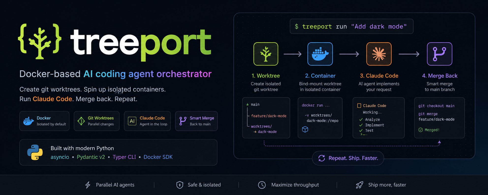

# treeport



> **Docker-based AI coding agent orchestrator** — Create git worktrees. Spin up isolated containers. Run your agent. Merge back. Repeat.

---

## What is treeport?

treeport is a Python library and CLI that runs AI coding agents inside **isolated Docker containers** backed by **git worktrees**. Every task the agent performs is sandboxed — no risk to your working directory, no leftover state, no conflicts.

You write a prompt. treeport handles everything else.

```bash
treeport run --agent claude-code --max-iterations 5
```

---

## How the loop works

```
┌─────────────┐     ┌─────────────┐     ┌─────────────┐     ┌─────────────┐
│  1. Worktree │────▶│ 2. Container│────▶│  3. Agent   │────▶│ 4. Merge    │
│             │     │             │     │             │     │    Back     │
│ git worktree│     │ bind-mount  │     │ implements  │     │ fast-forward│
│ add -b feat │     │ worktree →  │     │ your prompt │     │ → main      │
│             │     │ /repo       │     │             │     │             │
└─────────────┘     └─────────────┘     └─────────────┘     └─────────────┘
```

1. **Worktree** — A real git checkout on a fresh branch. No copying, no bundling.
2. **Container** — The worktree is bind-mounted into Docker. The agent writes directly to the host filesystem.
3. **Agent** — Your chosen AI agent (Claude Code, Aider, OpenAI, Gemini, or custom) runs inside the container.
4. **Merge back** — Commits are fast-forward merged to your target branch. The worktree is cleaned up.

---

## Supported agents

| Agent | Mode | Models |
|-------|------|--------|
| `claude-code` | Docker container | claude-opus-4-5, claude-sonnet-4-5 |
| `aider` | Docker container | GPT-4o, Claude, Gemini, DeepSeek, Ollama… |
| `openai` | API direct (no Docker) | gpt-4o, gpt-4o-mini, o1, o3-mini |
| `gemini` | API direct (no Docker) | gemini-2.0-flash, gemini-1.5-pro |
| `custom` | Docker container | Any CLI tool |

---

## Documentation

- [Getting Started](getting-started.md) — Install, scaffold, first run
- [Agents](agents.md) — All five agent backends, full config reference
- [Prompts](prompts.md) — Dynamic context, argument substitution, completion signals
- [API Reference](api.md) — `run()`, `RunOptions`, `RunResult`
- [CLI Reference](cli.md) — All commands and flags
- [Architecture](architecture.md) — Worktree + bind-mount internals
- [Hooks](hooks.md) — `on_sandbox_ready`, `copy_to_sandbox`
- [Recipes](recipes/) — Real-world usage patterns

---

## Quick install

```bash
pip install treeport
treeport init
treeport run
```
